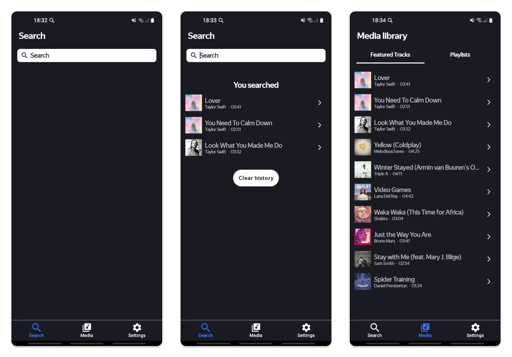
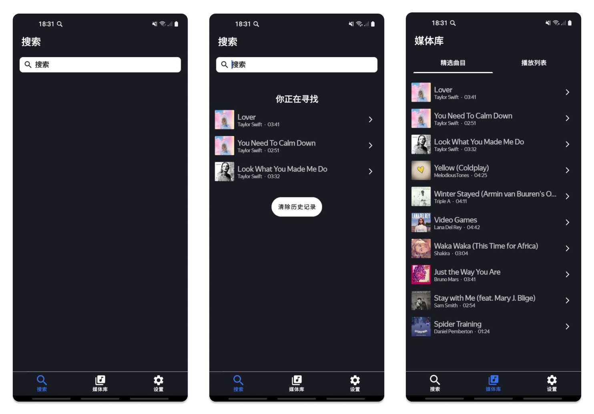
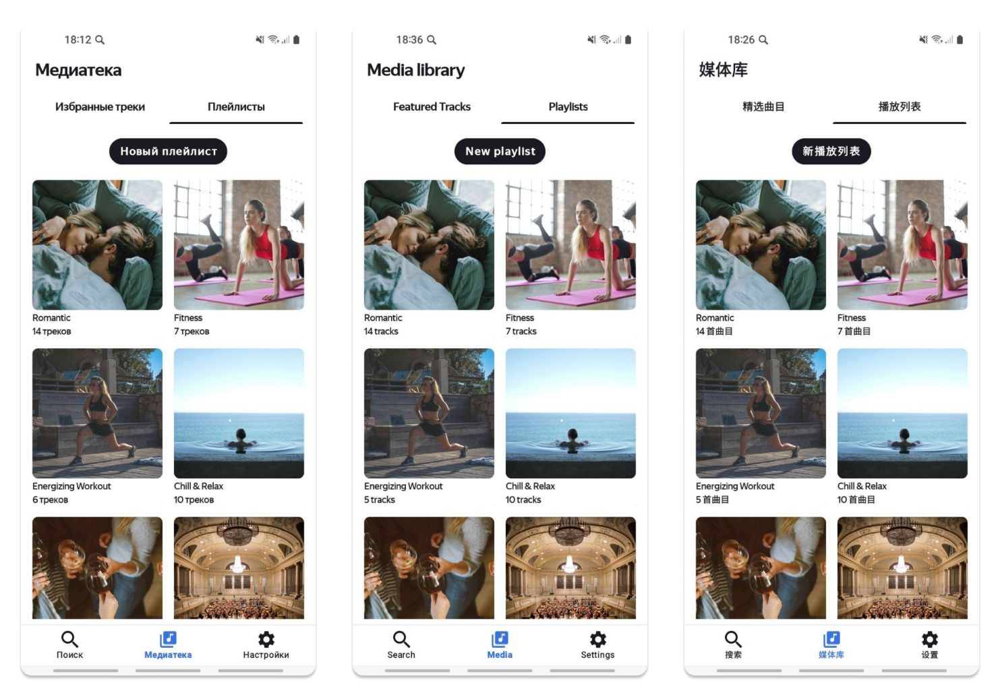
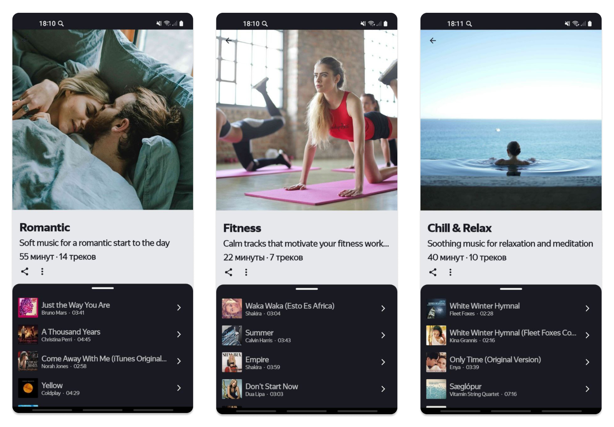
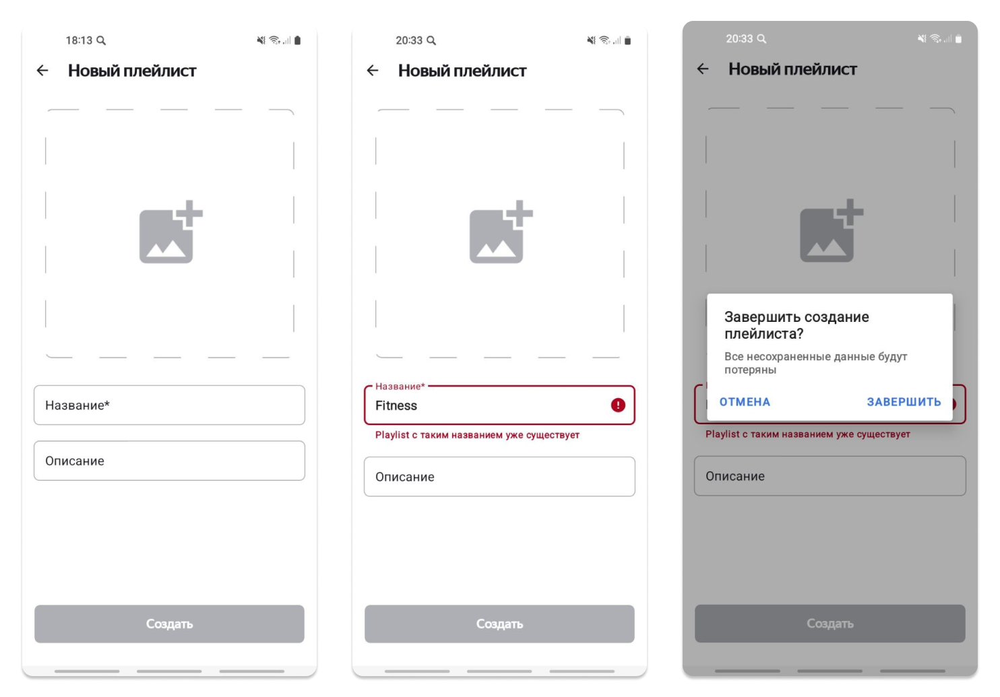
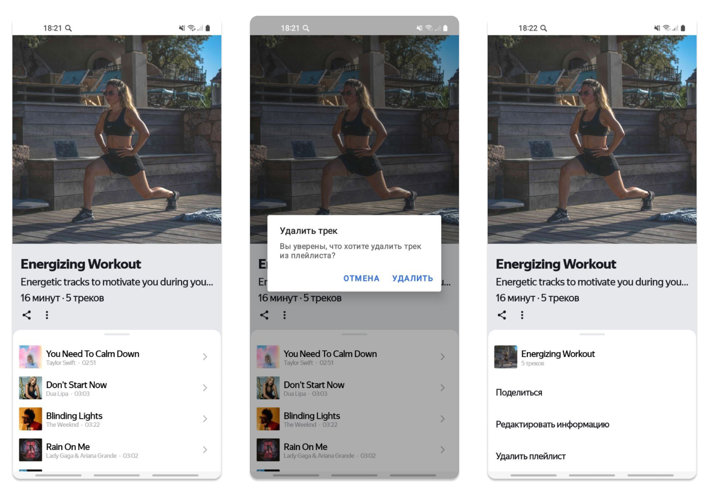

# Playlist Maker
## Пример приложения поиска аудиотреков на популярном сервисе [iTunes от Apple](https://itunes.apple.com) (https://itunes.apple.com)
## Стек применяемых технологий:
1. Язык Kotlin
2. Clean architecture, MVVM, Single Activity, REST, Coroutines, ThreadPoolExecutor, SQLite, SharedPreferences, BottomSheet, MediaPlayer, PhotoPicker
3. Библиотеки Koin, Glide, Gson, LiveData, Retrofit, OkHttp, Room, Android Jetpack

## Описание приложения:
Playlist Maker — это интуитивно понятное и функциональное приложение для поиска аудиотреков на популярном сервисе [iTunes от Apple](https://itunes.apple.com).
Приложение предлагает пользователям возможность легко находить любимую музыку, прослушивать демо-версии треков и управлять своими музыкальными предпочтениями с помощью умных плейлистов.

## Основные функции:
- **Поиск треков**: Быстрый и удобный поиск по названию, исполнителю или альбому.
- **Прослушивание демо**: Возможность прослушивания фрагментов треков без необходимости покупки.
- **Метаданные треков**: Полная информация о каждом треке, включая исполнителя, альбом и год выпуска.
- **Избранное**: Легкое добавление треков в список избранного для быстрого доступа.
- **Умные плейлисты**: Пользователи могут создавать и редактировать плейлисты, задавая обложку, название и описание. Плейлисты можно настраивать вручную, добавляя или удаляя треки по своему усмотрению.
- **Темы оформления**: Возможность переключения между светлой и темной темами интерфейса для удобства использования в любых условиях освещения.

## Многоязычность:
Playlist Maker поддерживает три языка: русский, английский и китайский. Интерфейс автоматически подстраивается под язык системы пользователя, обеспечивая удобство и доступность для широкой аудитории.

## Технологический стек:
Приложение построено с использованием современных архитектурных подходов и технологий:
- Clean Architecture и MVVM для обеспечения ясной структуры кода и легкости в сопровождении.
- Single Activity подход для упрощения навигации и управления состоянием.
- Использование REST API для взаимодействия с [iTunes](https://itunes.apple.com), что обеспечивает быстрый и надежный доступ к данным.
- Coroutines и ThreadPoolExecutor для эффективной работы с асинхронными задачами.
- Хранение данных с помощью SQLite и Room, а также использование SharedPreferences для хранения пользовательских настроек.
- Интеграция библиотек Koin для внедрения зависимостей, Glide для загрузки изображений, Gson для работы с JSON, LiveData для реактивного обновления UI, Retrofit и OkHttp для сетевых запросов, что обеспечивает высокую производительность и отзывчивость приложения.
- Использование компонентов Android Jetpack для упрощения разработки и повышения надежности приложения.

## Технологический стек:
Playlist Maker разработан с акцентом на улучшенный пользовательский опыт.
Интерфейс приложения интуитивно понятен, а все функции доступны в несколько кликов.
Приложение не только решает задачи пользователей, но и приносит удовольствие от использования.

## Скриншоты:

### Поиск треков и избранное:

Русский язык

Английский язык

Китайский язык

### Прослушивание демо треков:

Русский язык

### Просмотр всех плейлистов:

Русский, английский и китайский языки

### Просмотр плейлистов:

Русский язык

### Создание/редактирование плейлиста:

Русский язык

### Использование плейлиста:

Русский язык

### Настройки приложения:

Русский, английский и китайский языки

Мобильное приложение разработано в учебных/образовательных целях в рамках обучения в [Яндекс-Практикуме](https://practicum.yandex.ru/) (https://practicum.yandex.ru/)

Используемый контент:
- шрифты, дизайн и иконки в рамках обучения предоставлены [Яндекс-Практикумом](https://practicum.yandex.ru/) (https://practicum.yandex.ru/)
- обложки и мета-данные музыкальных композиций [iTunes от Apple](https://itunes.apple.com) (https://itunes.apple.com) (дата обращения 01 сентября 2024 года)
- обложки к плейлистам сервис [Unsplash](https://unsplash.com) (дата обращения 01 сентября 2024 года), авторы:
  * Toa Heftiba [фото](https://unsplash.com/photos/man-kissing-womans-forehead-while-lying-on-bed-2ey7dmVEQv4) (https://unsplash.com/photos/man-kissing-womans-forehead-while-lying-on-bed-2ey7dmVEQv4)
  * bruce mars [фото](https://unsplash.com/photos/group-of-women-doing-yoga-gJtDg6WfMlQ) (https://unsplash.com/photos/group-of-women-doing-yoga-gJtDg6WfMlQ)
  * Big Dodzy [фото](https://unsplash.com/photos/woman-in-black-sports-bra-and-black-shorts-sitting-on-concrete-bench-during-daytime-gTTtXwqmKPQ) (https://unsplash.com/photos/woman-in-black-sports-bra-and-black-shorts-sitting-on-concrete-bench-during-daytime-gTTtXwqmKPQ)
  * Alex Bertha [фото](https://unsplash.com/photos/woman-in-water-pool-Jyg7xHRmXiU) (https://unsplash.com/photos/woman-in-water-pool-Jyg7xHRmXiU)
  * Kelsey Chance [фото](https://unsplash.com/photos/group-of-people-tossing-wine-glass-tAH2cA_BL5g) (https://unsplash.com/photos/group-of-people-tossing-wine-glass-tAH2cA_BL5g)
  * Manuel Nägeli [фото](https://unsplash.com/photos/music-group-performing-on-stage-with-empty-audience-seats-NsgsQjHA1mM) (https://unsplash.com/photos/music-group-performing-on-stage-with-empty-audience-seats-NsgsQjHA1mM)